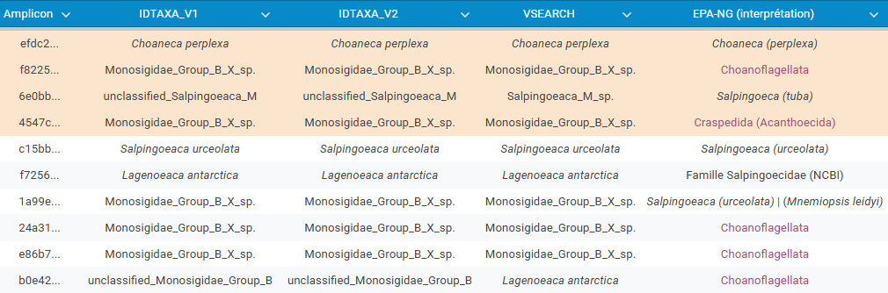

# Diversité et dynamique des choanoflagellés dans les eaux côtières de Roscoff

Mini-Projet - UE Méthodologies Scientifiques et Techniques, Master Sciences de la Mer (Sorbonne Université) \
Encadré par Nathalie Simon & Nicolas Henry \
Décembre 2024

Sophie BRASSEUR, Juliette SILHOL et Meije VERA

## Introduction

Les Choanoflagellés sont des protistes hétérotrophes ubiquistes appartenant au nanoplancton (taille comprise entre 3 et 10 µm en moyenne). Ce sont des organismes filtreurs, qui se nourrissent de picoplancton (picoeukaryotes et bactéries) et de détritus en filtrant chaque jour entre 10 et 25% des eaux côtières de surface (King, 2005), assurant le lien entre production primaire et niveaux trophiques supérieurs. La filtration se fait par ondulation d'un flagelle, induisant un courant qui permet le passage de l'eau à travers la collerette de microvillosités où les bactéries et détritus se retrouvent piégés. \
On distingue deux clades : les Craspedida et les Acanthoecida, les seconds se distinguant par la présence d'une lorica, structure extracellulaire en forme de panier permettant de freiner le recul induit par les mouvements du flagelle. \
Enfin, les Choanoflagellés constituent la lignée taxonomique la plus proche des métazoaires (autrement dit des animaux). Cette proximité phylogénétique est particulièrement intéressante d'un point de vue évolutif, par les perspectives qu'elle présente en termes de compréhension des processus à l'origine de la divergence des métazoaires. C'est notamment le cas pour les Craspedida (sans lorica), qui forment des colonies et pourraient donc présenter des gènes impliqués dans l'apparition de la multicellularité chez les métazoaires. Cependant, la diversité de ce groupe de Choanoflagellés reste encore peu connue.

Nous allons tout d'abord ici nous intéresser à la place des Choanoflagellés au sein des Eucaryotes, en évaluant leur contribution en termes de diversité et d'abondance, ainsi que leurs dynamiques temporelles. Nous essaierons également de mieux définir leur diversité, et notamment ici celles des Craspedida. \
Pour cela, nous sommes parties d'un jeu de données obtenu à partir des échantillons prélevés de façon bi-mensuelle à la station ASTAN (réseau SOMLIT), située au large de Roscoff, entre 2009 et 2016. L'ADN contenu dans ces échantillons a été extrait puis analysé par métabarcoding, résultant en une série temporelle comprenant plus de 8000 séquences ASV de la région V4 du gène ADNr 18S. Celui-ci code pour l'ARNr éponyme, faisant partie intégrante des ribosomes, éléments clés de la traduction des ARNm en protéines. Cette fonction au caractère "universel" induit une vitesse d'évolution relativement lente, ce qui permet de distinguer les espèces entre elles, à partir des divergences au sein de cette séquence. \
L'idée est donc d'utiliser différentes approches bioinformatiques pour, à partir de ces données, essayer de répondre aux objectifs mentionnés précédemment.

## Analyses (matériel & méthodes & résultats)

### Jeu de données et préparation avant analyses

Les séquences ASVs, associées à leurs assignations taxonomiques respectives, et à leur nombre de reads à la fois sur l'ensemble des échantillons et par échantillon, sont présentées dans le jeu de données SOMLIT-Astan time-series (2009-2016) rDNA 18S V4 ASV table (dada2), disponible sur : https://zenodo.org/records/8392525.

Après séquençage Illumina haut-débit (séquençage seconde génération), l'assignation taxonomique des ASVs obtenues a été faite via IDTAXA, avec pour référence les séquences de la base de données PR2 (version 4.14). IDTAXA implique une phase de "training", sur les séquences de référence qui sont divisées en subséquences appelées "k-mers". Le but de cet entrainement est de définir les k-mers qui permettent de distinguer les taxa entre eux, à chaque nouveau rang taxonomique (domaine, embranchement, ordre, ... jusqu'à l'espèce). Cela demande une information relativement importante et de qualité, et permet également d'évaluer le risque d'erreur d'assignation, ce qui assure des résultats relativement plus fiables que les approches seulement basées sur la similarité entre séquences. Cependant, les identifications taxonomiques en résultant vont moins souvent jusqu'à l'espèce, puisque l'évaluation du risque d'erreur empêche l'assignation lorsque le niveau de confiance passe au-dessous d'un certain seuil (ici fixé à 60%).

Chaque fois, l'échantillonnage a été fait pour deux classes de taille distinctes : 0,2-3µm et >3µm. Nous avons ici trié les données pour ne garder que les échantillons représentant la classe de taille >3µm, la taille des Choanoflagellés étant comprise entre 3 et 10µm (d'après [King, 2005](https://www.cell.com/current-biology/fulltext/S0960-9822(05)00142-9)). Nous avons également effectué un second tri pour ne garder que les ASVs assignés aux Eucaryotes, et un dernier pour retirer les échantillons présentant un total de reads inférieur à 15000 (valeur particulièrement basse par rapport aux attendus avec ce type d'approche).

Au final, le jeu de données présente ainsi 6085 ASVs, détectés de façon plus ou moins régulière sur 183 échantillons.

_Les scripts R (version 4.4.1) détaillés et expliqués sont rassemblés dans le notebook **main_notebook-R.ipynb**. Les scripts Bash supplémentaires, pour le placement phylogénétique EPA-ng et l'assignation taxonomique via VSEARCH, sont quant à eux dans le notebook **taxoassign-bash.ipynb**._

### Diversité et abondance

Après avoir clairement identifié les ASVs assignés aux Choanoflagellés, puis au sein de ceux-ci, ceux assignés respectivement aux Acanthoecida et aux Craspedida, deux calculs distincts ont été effectués :
- calcul de la proportion d'ASVs assignés aux Choanoflagellés (respectivement Acanthoecida, Craspedida, ainsi que Choanoflagellés non-assignés à l'un ou l'autre des deux clades), au sein des ASVs Choanoflagellés et au sein des Eucaryotes de façon générale
- calcul de la proportion de reads des ASVs Choanoflagellés (respectivement Acanthoecida, Craspedida, ainsi que "non-assignés") au sein de l'ensemble des reads (i.e. au sein des Eucaryotes), et par rapport à la proportion totale de reads d'ASVs Choanoflagellés

### Dynamique temporelle

La dynamique temporelle a été étudié via la visualisation graphique de la proportion de reads d'ASVs Chanoflagellés, et au sein de celle-ci, de celle des reads assignés aux Craspedida, et ce pour chaque date d'échantillonnage de 2009 à 2016.  \
Les résultats indiquent des proportions minimes. On remarque tout de même une hétérogénéité non-négligeable entre les différents ASVs Craspedida, en termes de régularité le long de la série temporelle, mais aussi d'abondance de reads. \
Quatre ASVs (parfois aussi appelés amplicons) sont identifiés par leur abondance ou régularité relativement plus importante que les six autres ASVs Craspedida.

### Ré-assignation taxonomique

Trois différentes méthodes d'assignation taxonomique vont être testées sur les ASVs assignés aux Craspedida. Le but est d'évaluer la capacité de ces différentes approches à mieux caractériser la diversité des Craspedida, en les inter-comparant entre elles.

On crée des fichiers .fasta avec les séquences des ASVs de Choanoflagellés et de Craspedida, stockés dans le dossier "Output".

#### A) IDTAXA
On reproduit ici l'assignation taxonomique à l'origine du jeu de données, mais cette fois avec la version la plus récente de la base de données PR2 (5.0.0) téléchargeable via le lien suivant, à placer dans le dossier "Input" : https://github.com/pr2database/pr2database/releases/download/v5.0.0/pr2_version_5.0.0_SSU.decipher.trained.rds. 
On conserve un seuil de confiance de 60%. Les résultats de l'assignation sont enregistrés dans le fichier "idtaxa_v2.tsv". \
Les résultats sont les mêmes que lors de la précédente assignation taxonomique avec la version 4.14 de la base PR2. Cela indique que les informations contenues dans cette base concernant la diversité des Choanoflagellés, et ici des Craspedida, n'ont pas évoluées depuis la dernière version.

#### B) VSEARCH
Cet algorithme se base sur une approche de similarité entre les séquences de référence et les séquences *query*. On utilise également la version 5.0.0 de la base PR2. On utilise ici un script bash (cf. première partie du fichier `taxoassign-bash.ipynb`).  \
Le script d'origine, que nous avons ici (légèrement) adapté, ainsi que les fichiers input nécessaires, sont disponibles sur : https://gitlab.com/metabarcoding_utils rendu accessible par Nicolas Henry. Les modifications qui y ont été apportées sont également décrites dans le fichier `taxoassign-bash.ipynb`. \
Les résultats sont disponibles dans le fichier Output/nextflow. Ils sont similaires à ceux d'IDTAXA mais peuvent aller plus loin dans le rang taxonomique. Cela s'explique par le fait que VSEARCH attribue directement la séquence de référence la plus similaire, sans prendre en compte le risque d'erreur, contrairement à IDTAXA qui n'assigne pas de taxa si le niveau de confiance passe sous le seuil fixé. L'assignation taxonomique faite par VSEARCH a des chances d'être la bonne, mais le niveau de confiance reste plus faible.

#### C) Placement phylogénétique avec EPA-NG
Les séquences utilisées pour calculer l'arbre phylogénétique de référence proviennent de l'article de Hake et al., 2024 et sont disponibles sur : https://figshare.com/articles/dataset/Data_from_Colonial_choanoflagellate_isolated_from_Mono_Lake_harbors_a_microbiome/14474214?file=27703662 (nous avons utilisé le fichier "18S_EFL_HSP90.concatenated.nex.con.tre" figurant dans le fichier zip "tree_figure_1C").
On enracine l'arbre en ajoutant en tant qu'*outgroup* des séquences de métazoaires, groupe "frère" des Choanoflagellés. Cette étape est nécessaire pour le calcul d'un arbre pertinent. L'arbre de référence calculé est enregistré en format newick. \
On utilise ici la deuxième partie du fichier "taxoassign-bash.ipynb" pour aligner les ASVs choisies avec les séquences de l'arbre de référence avec mafft. \
La visualisation de l'arbre peut ensuite se faire dans le script principal à partir des résultats obtenus. \
On observe que divers ASVs sont placés sur plusieurs noeuds. La somme des probabilités associées à chaque placement est égale à 1 pour chaque ASV. Le placement sur un noeud au niveau de l'espèce ne veut pas forcément dire que l'ASV correspond à cette espèce ; elle peut appartenir à une espèce voisine pas encore décrite ou non disponible sur cet arbre de référence (qui correspondrait à une branche parallèle non-représentée).

## Conclusion

Les Choanoflagellés, et en particulier les Craspedida, représentent une faible proportion de la diversité  des ASVs analysés à la station Astan (respectivement 1.38% et 0.16% des ASVs).
Certains ASVs sont plus abondants et/ou plus réguliers que d'autres sur la période d'échantillonnage (2009-2016). \
La comparaison des méthodes d'assignation taxonomique (cf. tableau suivant) montre une cohérence entre les résultats, malgré des précisions taxonomiques différentes : l'utilisation d'un arbre de référence donne des résultats plus prudents mais plus robustes. Au contraire, l'utilisation de VSEARCH donne le rang taxonomique le plus précis mais avec un taux de confiance plus faible. IDTAXA peut ici être considéré comme un "entre-deux". \
L'ensemble de ces résultats montre que les connaissances taxonomiques actuelles sont souvent insuffisantes pour permettre une assignation certaine à l'espèce. Cependant, la convergence de ces différentes méthodes sur les quelques assignations obtenues jusqu'à l'espèce assure un meilleur taux de confiance aux résutats en question. On commence ainsi, tout de même, à décrire certaines espèces de Craspedida. On note également que différents genres sont représentés parmi les ASVs les plus abondants.

L'amélioration de la phylogénie de ce groupe est nécessaire pour mieux caractériser et distinguer les taxa entre eux, et évaluer leur place au sein des écosystèmes côtiers. \
Par ailleurs, il serait intéressant, pour tenter d'expliquer les variations temporelles observées, de mettre en relation les résultats obtenus avec les données environnementales mesurées à la station Astan, disponibles sur : https://www.seanoe.org/data/00854/96634/

## Aspect FAIR de l'analyse 

- Facile à trouver : les données des ASVs détectés à la station Astan, la base de données de référence utilisée pour IDTAXA et VSEARCH, ainsi que la base de données utilisée pour le calcul de l'arbre de référence sont détaillées dans le README. Les jeux de données utilisés sont dotés de liens stables et pérennes dans le temps (**doi**).
- Accessible : Les données sont toutes accessibles publiquement et gratuitement.
- Interopérable : Les analyses peuvent être adaptées à d'autres données d'ASVs et d'autres bases de données de référence. Un autre arbre phylogénétique de référence peut être utilisé également. Cependant, tous les fichiers doivent être téléchargés à la main et certaines lignes de code doivent être adaptées aux spécificités du jeux de données.
- Réutilisable : toutes les analyses sont détaillées dans les notebooks **main_notebook-R.ipynb** et **taxoassign-bash.ipynb**.